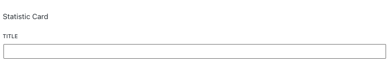

# WP Dynamic Blocks
This repository is for the WP Dynamic Blocks plugin.

The WP Dynamic Blocks plugin contains dynamic blocks to show content in Wordpress pages.

## Instalation

Download this repository as .zip file and install it in 'Plugins/Add New section' in Wordpress dashboard.

## Available Blocks
This plugin has the following blocks included:
- Statistic Card: this block allows to show the count about a specific element

## Usage
To add a new Statistic Card, you must search for it in Wordpress Editor. After that you will see something like this:

In "Title" textbox you must set the element title.

In block options (in right panel), you can upload an icon image, set value color, set title color and set the endpoint that will get the total number of a specific element:

