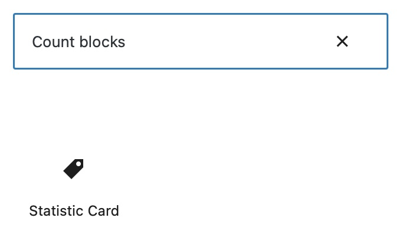

# WP Count Blocks
This repository is for the WP Count Blocks plugin.

The WP Count Blocks plugin contains dynamic blocks to show content in Wordpress pages.

## Instalation

Download this repository as .zip file and install it in 'Plugins/Add New section' in Wordpress dashboard.

## Available Blocks
This plugin has the following blocks included:
- Statistic Card: this block allows to show the count about a specific element

## Usage
### Statistic Card
To add a new Statistic Card, you must search for 'Count blocks' in Wordpress Editor:

After that you will see something like this:

In "Title" textbox you must set the element title.

And in block options (in right panel), you can upload an icon image, set value color, set title color and set the endpoint that will get the count you want to show:

## License
The code in ths repository is licensed under the [MIT License](https://opensource.org/licenses/MIT).
